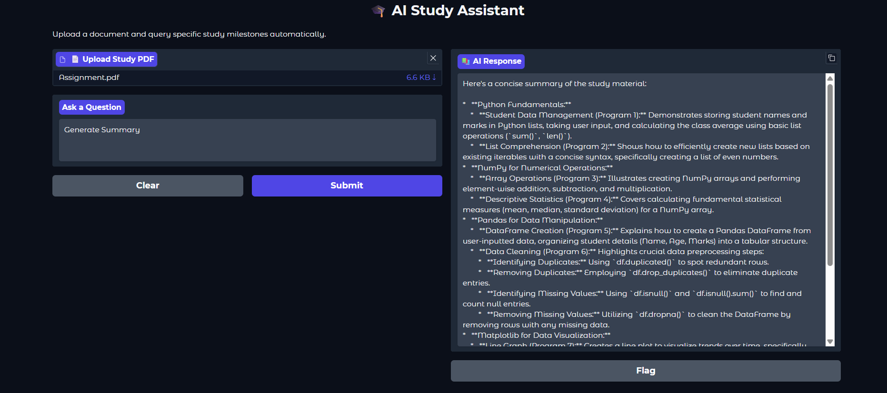
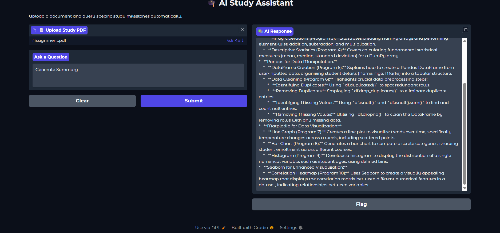
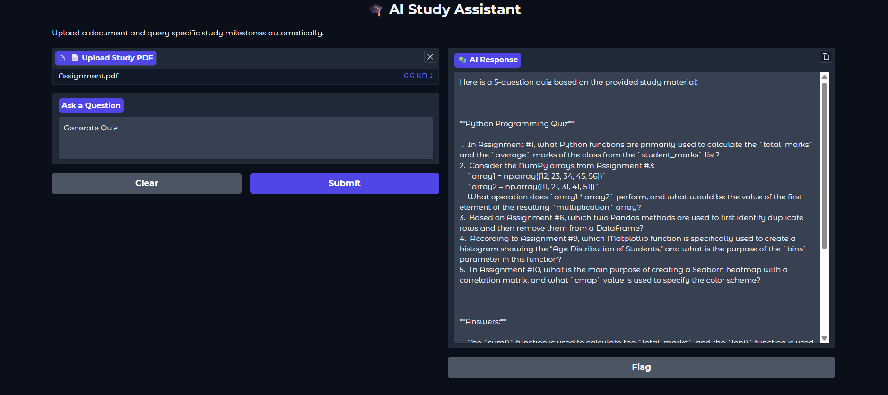
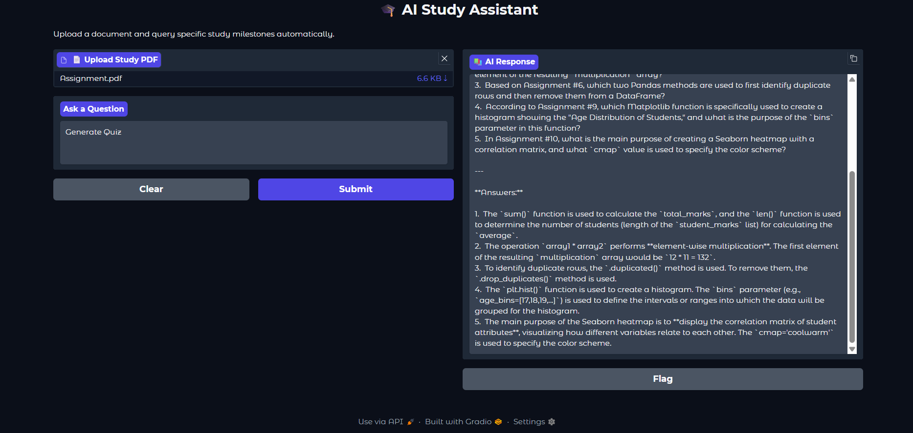

## `# AI Study Assistant Chatbot` 

## `## Project Overview` 

```
The AI Study Assistant Chatbot is an educational AI application developed using
Python, Gradio, Google Gemini AI, and PyMuPDF. The system enables students to
upload PDF-based study materials and interact with them using natural language
queries.
```

```
Unlike traditional document readers, the chatbot analyzes uploaded content and
provides intelligent educational assistance such as summaries, quizzes, MCQs,
flashcards, study plans, and context-aware answers. The application transforms
static learning resources into interactive study tools that improve learning
efficiency and student productivity.
```

```
---
```

## `## Features` 

## `### PDF Upload and Processing` 

- `Upload study materials in PDF format.` 

- `Extract text from all pages using PyMuPDF.` 

- `Supports lecture notes, manuals, e-books, and academic documents.` 

## `### AI-Powered Question Answering` 

- `Answers questions based on uploaded study material.` 

- `Uses Google Gemini AI for intelligent response generation.` 

- `Provides context-aware explanations.` 

## `### Automatic Summary Generation` 

- `Generates concise summaries of uploaded documents.` 

- `Highlights important concepts and key points.` 

- `Uses bullet-point formatting for readability.` 

## `### Quiz Generation` 

- `Creates practice quizzes from study materials.` 

- `Generates questions automatically.` 

- `Includes answer keys for self-assessment.` 

## `### MCQ Generation` 

- `Produces multiple-choice questions.` 

- `Provides four answer options for each question.` 

- `Displays correct answers separately.` 

## `### Flashcard Creation` 

- `Generates question-and-answer flashcards.` 

- `Useful for revision and active recall learning.` 

## `### Study Plan Generation` 

- `Creates structured 7-day study schedules.` 

- `Includes revision and practice sessions.` 

- `Helps students organize learning efficiently.` 

## `### Real-Time Streaming Responses` 

- `Displays Gemini AI responses progressively.` 

- `Improves user experience by reducing perceived waiting time.` 

```
---
```

## `## Technologies Used` 

```
| Technology            | Purpose                       |
| --------------------- | ----------------------------- |
| Python                | Core Programming Language     |
| Gradio                | Web User Interface            |
| Google Gemini AI      | Generative AI Response Engine |
| PyMuPDF (fitz)        | PDF Text Extraction           |
| Environment Variables | Secure API Key Management     |
```

```
---
```

```
## Project Structure
```

```
```text
AI-Study-Assistant/
│
├── app.py
├── README.md
├── requirements.txt
└── screenshots/
    ├── home_interface.png
    ├── summary_generation_1.png
    ├── summary_generation_2.png
    ├── quiz_generation_1.png
    └── quiz_generation_2.png
```
---
```

```
## Installation
### Step 1: Clone Repository
```

```
```bash
git clone https://github.com/saiankush-prog/AI-Study-Assistant.git
cd AI-Study-Assistant-Chatbot
```
```

```
### Step 2: Install Dependencies
```bash
pip install -r requirements.txt
```
```

```
---
## Configure Gemini API Key
### Windows
```cmd
set GEMINI_API_KEY=YOUR_API_KEY
```
```

```
### Linux / macOS
```bash
export GEMINI_API_KEY=YOUR_API_KEY
```
```

```
---
```

```
## Running the Application
```

```
```bash
python app.py
```
```

```
The Gradio interface will launch automatically in your browser.
```

```
---
```

```
## How to Use
```

```
### 1. Upload a PDF
```

```
Upload any study material such as:
```

```
* Lecture notes
```

```
* Academic books
```

```
* Lab manuals
```

```
* Course handouts
```

```
### 2. Enter a Request
```

```
Example prompts:
```

```
```text
Generate Summary
```
```

```
```text
Generate Quiz
```
```text
Generate MCQs
```
```text
Generate Flashcards
```
```

```
```text
Create Study Plan
```
```

```
```text
Explain Chapter 1
```
```

```
```text
What is Machine Learning?
```
```

```
### 3. Receive AI Response
```

```
The chatbot processes the uploaded document and generates the requested output.
```

```
---
```

```
## Screenshots
```

```
### Home Interface
The main interface of the AI Study Assistant allows users to upload study materials and enter queries for AI-powered assistance.


```

```
### Summary Generation
```

```
The chatbot automatically generates concise summaries of uploaded study materials, highlighting key concepts and important points.



```

```
### Quiz Generation
```

```
The chatbot can create practice quizzes from uploaded documents, helping students test their understanding of the material.



```

```
---
```

```
## System Workflow
```

```
```text
User Uploads PDF
        │
        ▼
PDF Text Extraction
        │
        ▼
Intent Detection
        │
 ┌──────┼───────────────┐
 │      │       │       │
 ▼      ▼       ▼       ▼
Summary Quiz   MCQ  Flashcards
        │
        ▼
Gemini AI Processing
        │
        ▼
Streaming Response
        │
        ▼
Display Result
```
```

```
---
```

## `## Intent Detection Logic` 

```
The chatbot automatically detects user intent using keyword-based routing.
```

```
| User Input      | Action                |
| --------------- | --------------------- |
| summary         | Generate Summary      |
| quiz            | Generate Quiz         |
| mcq             | Generate MCQs         |
| flashcard       | Generate Flashcards   |
| study plan      | Generate Study Plan   |
| Other Questions | AI Question Answering |
```

```
---
```

## `## Advantages` 

- `Interactive learning experience.` 

- `Reduces manual note preparation.` 

- `Supports self-assessment.` 

- `Encourages active learning.` 

- `Generates personalized study resources.` 

- `User-friendly interface.` 

```
---
```

## `## Future Enhancements` 

```
### Semantic Intent Routing
```

```
Replace keyword matching with advanced intent classification using NLP models.
```

## `### OCR Support` 

```
Enable extraction from scanned PDFs and image-based documents using OCR
technologies.
```

## `### Retrieval-Augmented Generation (RAG)` 

```
Implement vector databases and embeddings for handling large document
collections efficiently.
```

## `### Multi-Document Support` 

```
Allow simultaneous analysis of multiple PDFs.
```

## `### Chat History` 

```
Maintain previous conversations for context-aware interactions.
```

```
### Voice-Based Queries
```

```
Support speech-to-text and voice responses.
```

## `### Performance Optimization` 

```
Chunk documents and retrieve only relevant sections before querying Gemini AI.
```

```
---
```

## `## Applications` 

- `Students` 

- `Teachers` 

- `Researchers` 

- `Competitive Exam Preparation` 

- `Online Learning Platforms` 

- `Academic Institutions` 

```
---
```

## `## Author` 

```
**Sai Ankush**
```

```
This project was developed as part of an academic learning initiative to explore
the practical applications of Artificial Intelligence, Natural Language
Processing, and Large Language Models in the field of education.
```

